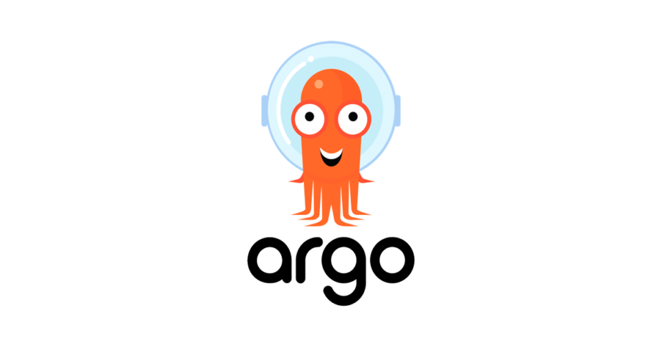

# cicd-with-argo-stack

## 💡 Description of the scenario
We want to combine `Argo CD`, `Argo Rollouts`, `Argo Workflows`, and `Argo Events` in the form of a scenario and project to see how they work together in the real world. First, we'll set up Nexus as our artifact repository to store Docker images and set up a private GitLab as our code repository. Argo Events help us trigger the workflow that we want to create. Then, using Argo Events Custom Resource Definitions (CRDs), we'll create a resource named "event-source" to connect to our desired project on GitLab (assuming this project includes the source code of the application). By doing this, a webhook will be automatically created on this project in GitLab. Upon any changes to this project, this webhook is called. The workflow needs to be automatically executed by Argo Events. For this reason, we'll create a resource named "sensor" whose task is to execute the workflow. But what is the task of workflows in this scenario? Using Argo Workflows, we'll write a CI pipeline whose task is to build a Docker image and push it to Nexus. Argo Workflows will then go to the Rollouts manifest and change the tag of the previous image with the new value. At this stage, when the Rollouts manifest changes, Argo CD detects the new change and applies it to the Kubernetes cluster. In this scenario, we have used the canary strategy in the Rollouts manifest.

This repository has two different sections to follow:
  - Requirements of this scenario
  - Executing the scenario

## 🔎 Requirements of this scenario

:one: **Install sonatype nexus repository in your nexus server:**

    cd nexus/ && docker-compose up -d
If Nexus is up and running, create a repository named `argo-demo` with the type `docker (hosted)` and set its HTTP port to `8085`.

:two: **Add private registry to Docker/containerd in your kubernetes cluster:**

**Docker:**

    cat <<EOF | sudo tee /etc/docker/daemon.json
    {
      "insecure-registries": ["REPLACE_ME_WITH_NEXUS_IP_ADDRESS:8085"]
    }
    EOF
**Containerd:**

    sudo tee -a /etc/containerd/config.toml <<EOF
    [plugins."io.containerd.grpc.v1.cri".registry]
      [plugins."io.containerd.grpc.v1.cri".registry.mirrors]
        [plugins."io.containerd.grpc.v1.cri".registry.mirrors."REPLACE_ME_WITH_NEXUS_IP_ADDRESS:8085"]
          endpoint = ["http://REPLACE_ME_WITH_NEXUS_IP_ADDRESS:8085"]
    EOF
Restart the service

**Test everything is working well:**

    docker login -u USERNAME NEXUS_IP_ADDRESS:8085
    docker pull nginx:alpine
    docker tag nginx:alpine NEXUS_IP_ADDRESS:8085/nginx:alpine && docker push NEXUS_IP_ADDRESS:8085/nginx:alpine

:three: **Install and configure Gitlab**
   - Install GitLab on your GitLab server
   - Create two different repositories named `argo-config` and `my-app` in GitLab
   - Put the content of the `argo-cd`, `argo-rollouts` and `argo-events` directories into the `argo-config GitLab repository`
   - Put the content of the `my-app` directory into the `my-app GitLab repository`

:four: **Create these namespaces in your Kubernetes cluster:**

    kubectl create ns argocd
    kubectl create ns argo-rollouts
    kubectl create ns argo
    kubectl create ns argo-events

:five: **Install argo-cd, argo-rollouts, argo-workflows and argo-events in your kubernetes cluster**
  - **Argo-CD:**
    - https://argo-cd.readthedocs.io/en/stable/operator-manual/installation/
    - https://argo-cd.readthedocs.io/en/stable/getting_started/
  - **Argo-Rollouts:**
    -  https://argo-rollouts.readthedocs.io/en/stable/installation/
  - **Argo-Workflows:**
    -  https://argo-workflows.readthedocs.io/en/latest/installation/
    -  https://argo-workflows.readthedocs.io/en/latest/quick-start/
  - **Argo-events:**
    - https://argoproj.github.io/argo-events/installation/
    - https://argoproj.github.io/argo-events/quick_start/

:six: **Create a Kubernetes secret in your Kubernetes cluster containing authentication credentials for Nexus:**

    kubectl create secret generic -n argo-events docker-config-secret --from-file=/path/to/.docker/config.json

:seven: **Install Minio in your kubernetes cluster and integrate it with Argo Workflows to store workflows artifacts:**

    helm install -n argo-events argo-artifacts oci://registry-1.docker.io/bitnamicharts/minio --set service.type=NodePort --set service.nodePorts.api=32073 --set service.nodePorts.console=32074 --set fullnameOverride=argo-artifacts
**Retrieve your ROOT-PASSWORD and ROOT-USER:**

    echo `kubectl get secret argo-artifacts --namespace argo-events -o jsonpath="{.data.root-password}"| base64 --decode`
    echo `kubectl get secret argo-artifacts --namespace argo-events -o jsonpath="{.data.root-user}"| base64 --decode`
**Create a kubernetes secret in the `argo-events` namespace, so workflows can use it to connect to minio:**

    kubectl create secret -n argo-events generic my-minio-cred --from-literal=root-user='REPLACE_ME_WITH_BASE64-DECODED-VALUE-OF-THE-ROOT-USER' --from-literal=root-password='REPLACE_ME_WITH_BASE64-DECODED-VALUE-OF-THE-ROOT-PASSWORD'

**Create a kubernetes configmap in the `argo-events` namespace, so workflows can use it to store artifacts in minio:**

    kubectl apply -f minio/minio-artifact-repo-cm.yml -n argo-events

## 🔎 Executing the scenario

**Test the scenario to see how it works**

**Proceed with these steps in order once the previous step is completed**

  1. Install your first argo-cd application using `kubectl apply -f argo-cd/argo-app.yml -n argocd`
  2. Apply argo-events resources in your kubernetes cluster using `kubectl apply -f argo-events/ -n argo-events`
  3. Open the browser and type the url of argo,rollouts, argo-cd and argo-workflows to see their dashboards and also type the url of your app: `http://argo.demo` (it has been deployed on your kubernetes cluster in step `1`)
  4. Modify the `index.html` file that exists in your `my-app GitLab repository`
  5. If you check the Argo Workflows dashboard, you'll see that a workflow is running, triggered by a push event in your `my-app GitLab repository`
  6. The default polling interval in Argo CD is 3 minutes, indicating how frequently Argo CD checks for changes in your Git repository. Wait for 3 minutes or refresh your Argo CD app using its dashboard or CLI manually
  7. As specified in the Argo Rollouts manifest, `20%` of the traffic is directed to the new version of the app and the promotion is paused until you manually unpause it (check `http://argo.demo` and refresh the page multiple times). If you are confident that everything is in order with the new version of the app, type `kubectl argo rollouts promote nginx-rollouts -n argo-demo` and then check the Argo Rollouts dashboard again. so, after a few minutes, you'll fully switch to the new version of your application. In this scenario, we are using the `canary` strategy, but you can also opt for the `blue-green` strategy if you prefer
